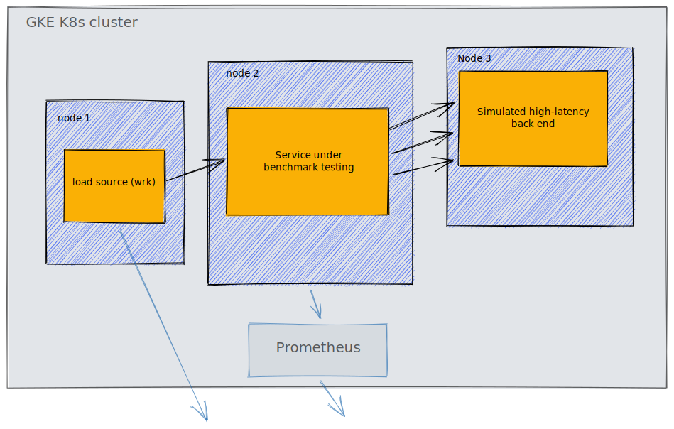

# Microservice Benchmarks

A comparison of technologies in a typical microservice scenario, focusing on resource consumption under high load.

## Scenario

A common scenario for microservices is that they orchestrate across number of backend services. Often those services are legacy, with high latency. The goal of this exercise is to highlight the differences between several tech choices in terms of how well they perform in that situation.

We're focusing on a RESTful HTTP API, which for each incoming request, makes a small number of upstream API requests, collects data from the responses and responds to the original request. The majority of the time taken to respond is just waiting for responses from upstream requests. Therefore the performance is IO-bound. We believe this is a fairly typical scenario in microservice architectures in large-scale enterprise systems.

## Performance measures

We're assuming these services run under cluster orchestration (e.g. Kubernetes) and inside linux containers (e.g. Debian in Docker). On that basis we're focusing on:

- throughput under a certain level of resource constraints (CPU & RAM)
- resource consumption required to handle a fixed high throughput
- startup time and resource usage until ready to handle requests

## Experiment setup

The experiment runs on a Kubernetes cluster (GKE in GCP), running 3 nodes:

- node for source of traffic load and benchmark (`wrk`)
- node for service under test
- node for a simulated back-end (e.g. 2-second latency)

The service under test for each incoming request will make `n` upstream requests in parallel to a simulated back-end, wait for responses and return aggregated data to the load source.

The simulated back-end will hold the connection open, wait for `t` seconds and respond.

Running this in Kubernetes adds a significant amount of complexity and overhead, but because each test is under the same conditions, this should not matter. Note that the absolute values are therefore not significant in any way; only the relative results matter.

## Candidate technology stacks tested

1. Java, Spring Boot with Servlet API (Tomcat, `@Async`). Thread pool concurrency model (blocking IO) for incoming and outgoing requests
2. Java, Spring Boot with Reactive API. Fully non-blocking IO.
3. Go, using standard library. Fully non-blocking IO.
4. Node.js, express, node-fetch. Fully non-blocking IO.
5. Rust, tide, surf. Fully non-blocking IO.

We are comparing Java to the other technologies because it is a common choice made by our clients for building microservices.

We expect the latter 3 to outperform the former 2 and are interested in by how much.

## Simulated back-end API service

We will also test the performance limits of the legacy back-end to ensure that capacity here is not a problem. However, tech choice is much less relevant here, so we choose Go and Rust, for self-indulgent purposes :-)

The back-end service will have excess resources available to it.

## TODO list

- API contract between load source and SUT (`GET /api`, application/json)
- API contract between SUT and simulated legacy back-end (SLBE) (merged output from 3 upstream responses)
- Build SLBE
- Deploy SLBE and load test to find capacity limits (number of concurrent requests)
- Build 5 x SUT
- Design and run experiments

### Notes

- decent amount of pre-canned JSON in each response (shallow object)
- SUT takes 3 upstream responses and merges them into one shallow object
